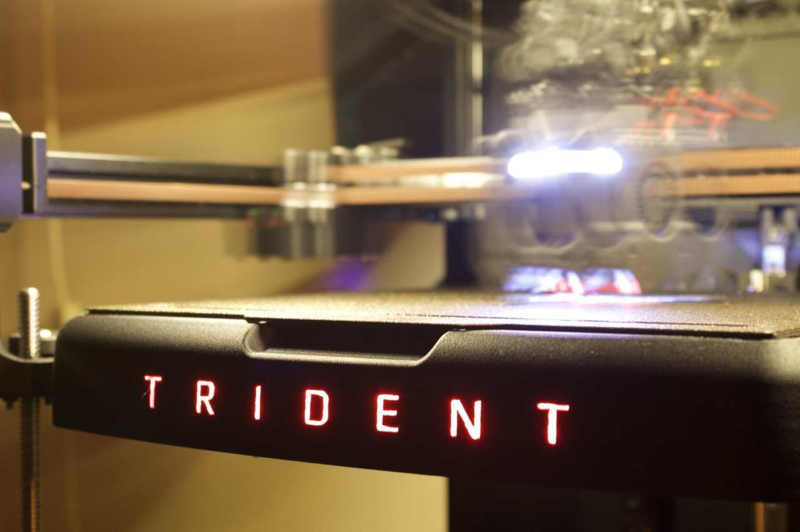

## 🧠 Features
- Designed specifically for **Voron Trident 250 mm**.
- ⚠️⚠️⚠️ Not compatible with other Trident sizes at the moment.
- Illuminated "Trident" logo using two internal LED strips.
- Easy to install and remove.
- Designed as a concept compatible with **status LEDs** or alternative illuminated logo designs.
- Can slightly help maintain **bed temperature stability** when printing with **open doors** or in **cooler environments**.

## 📦 Download the Models

All STL files are available on **Printables**:

👉 [🔗 Voron Trident Bed Front Cover with LED Logo – Printables]([https://www.printables.com/@Panchodelis](https://www.printables.com/model/1452981-voron-trident-bed-front-cover-with-led-logo)

## 🧩 Print Settings

This design consists of **seven printed parts**:

1. **Mounting structure** – supports the frontal assembly.  
2. **Front cover** – main visible part with the illuminated “Triden” logo.  
3. **LED diffuser** – translucent insert for the logo.  
4. **LED and wiring support** – holds the LED strips and manages cable routing.  
5. **Rear cover** – blocks any light escaping through the convection vent holes.  
6. **Letter “D”** – printed separately for proper detail.  
7. **Letter “R”** – printed separately for proper detail.

---

### ⚙️ Materials

All parts except the diffuser should be printed in **ASA-CF** (carbon fiber–reinforced ASA) to ensure high heat resistance and dimensional stability.  
ASA-CF softens around **105–110 °C**, making it suitable for components close to the heated bed.  
It also offers a premium matte finish and reduced warping compared to standard ASA or ABS.

The **LED diffuser** is printed in **translucent PETG**, which provides smooth light transmission and is easy to post-process.

Other materials such as **ABS-GF**, **ASA**, **ABS**, or **PETG-CF** can be considered as alternatives depending on availability and enclosure temperature control.  
Before selecting an alternative, always check the **glass transition temperature (Tg)** of the material and keep a **safety margin below your normal bed temperature** to prevent softening or deformation during operation.

There is a **minimum clearance of approximately 3.5 mm** between the aluminum bed plate and the front cover.  
This gap allows a **column of cool air** to rise naturally between both surfaces, reducing **thermal radiation coupling** from the bed to the printed part by an estimated **20–30 %**, depending on ambient conditions.

---

| Setting | Recommended Value |
|----------|-------------------|
| Material | ASA-CF for all parts except LED diffuser (PETG translucent) |
| Layer Height | Optional (depends on desired finish) |
| Infill | 20–40 % |
| Supports | Required (see notes below) |
| Orientation | Logo facing up for main parts / letters facing up for diffuser |

---

### 🧠 Important Notes

#### 🧱 Front Cover
- Pay **special attention to the “N” letter** — part of it prints directly on the support surface.  
  Verify in your slicer preview that sufficient support is generated below this area.  
- The **“E” letter** also requires proper supports; without them, it may collapse during printing.  
- For the **“D” and “R” letters**, print them separately and maintain the **same orientation** as the front cover for consistent layer direction and surface texture.  
- Use **manually painted supports** for the logo area and **tree supports** for the letters to achieve cleaner results and easier removal.

#### 💡 LED Diffuser
- Print **flat with the letters facing upward**, using **automatic supports**.  
- Avoid overly dense supports to simplify cleanup after printing.

---

### 🛠️ Slicing tolerances

- **Main panel slot tolerance:** +0.05 mm  
- **LED diffuser contour tolerance:** −0.10 mm  
- If the diffuser doesn’t fit easily, try **−0.15 mm** for a looser fit.

After printing, minor cleanup of the letters may be needed to remove support residue and ensure a precise fit of the PETG diffuser.

## 📦 Bill of Materials (BOM)

| # | Item | Specification / Notes | Quantity |
|---|------|------------------------|-----------|
| 1 | **Mounting structure** | Printed part (ASA-CF) | 1 |
| 2 | **Front cover** | Printed part (ASA-CF) | 1 |
| 3 | **LED diffuser** | Printed part (translucent PETG) | 1 |
| 4 | **LED and wiring support** | Printed part (ASA-CF) | 1 |
| 5 | **Rear cover** | Printed part (ASA-CF) | 1 |
| 6 | **Letter "D"** | Printed part (ASA-CF) | 1 |
| 7 | **Letter "R"** | Printed part (ASA-CF) | 1 |
| 8 | **LED strips** | 24 V LED strip, **5 mm width**, **red color**, SMD 2835 type | 2 |
| 9 | **M3 socket head screws (8 mm)** | ISO 7380 or DIN 912 | 4 |
| 10 | **M3 socket head screws (14 mm)** | ISO 7380 or DIN 912 | 7 |
| 11 | **M3 T-nuts** | Compatible with 2020 aluminum extrusion | 3 |
| 12 | **M3 threaded inserts** | Standard Voron brass heat inserts Ø5 mm outer diameter | 8 |
| 13 | **Wire (24 V rated)** | Red/black, silicone insulated | As needed |
| 14 | **Power connectors (DC jack)** | 2-conductor 24 V DC barrel connectors — **1 male + 1 inline female (non-panel type)** | 2 |
| 15 | **JST connector (for MCU)** | **JST 3-pin** (for fan port on Leviathan or similar board) – use matching type for your MCU port | 1 |
| 16 | **Cable sleeve or heat shrink** | For neat cable routing | As needed |

---

### 💡 Notes
- The LED channels are designed for **5 mm wide strips**, which **slide into dedicated guide rails** — no adhesive required.  
- The design allows for easy removal or replacement of LED strips for maintenance.  
- LED strips are **24 V SMD 2835 red**, compatible with fan ports on the **MCU Board**.  
- If your board provides **5 V** instead of 24 V, use a **5 V LED strip** of the same 5 mm width.  
- Power is routed through a **pair of DC jack connectors (male + female)** for quick disconnection.  
- Ensure the LED circuit is **fused** or connected through a **switched 24 V rail**.  
- The **rear cover is optional** — light bleed through the convection vents will depend on LED brightness.  
  For reference, the LEDs in the reference build run at **~10 % intensity** from a **24 V fan port**, resulting in minimal light leakage and balanced illumination.
